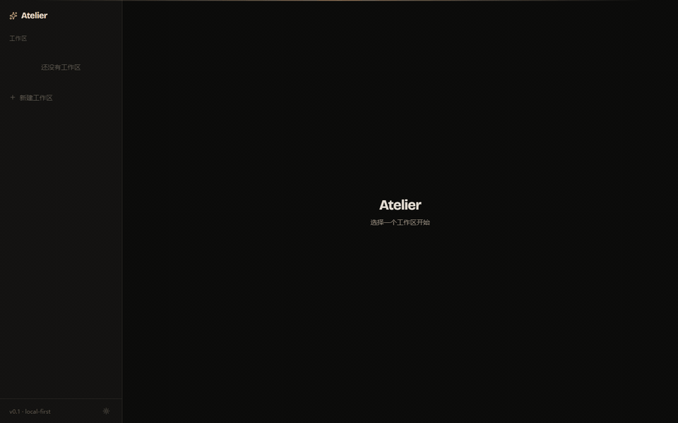
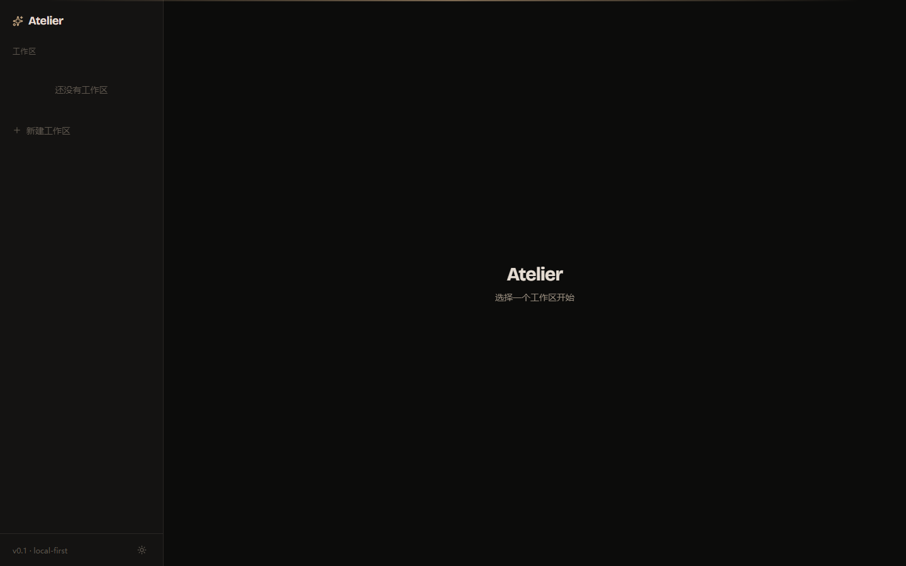
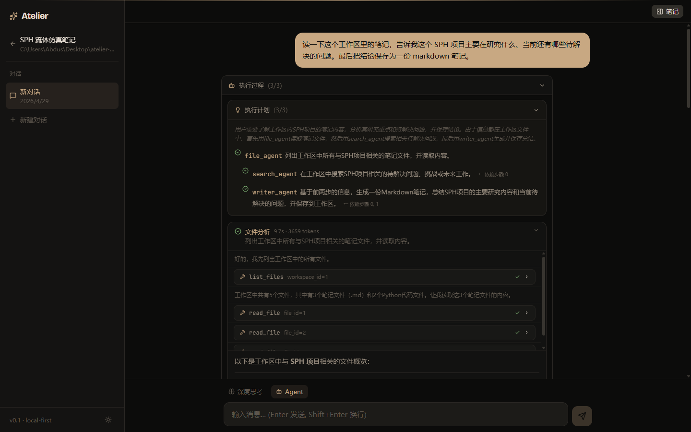
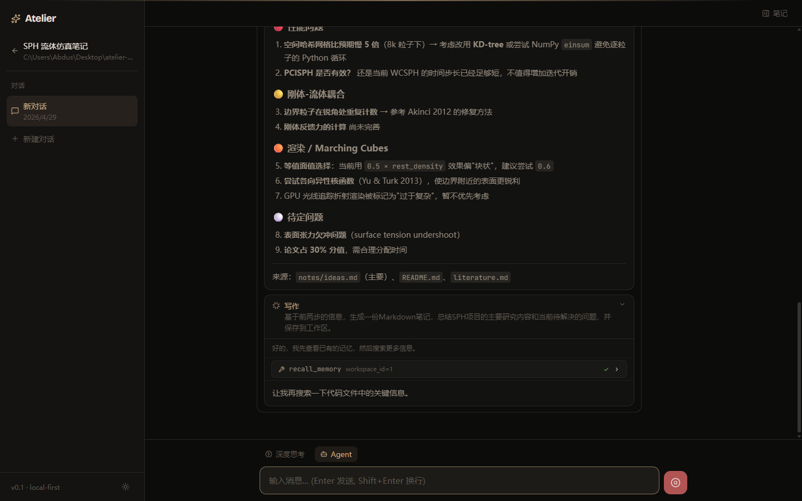
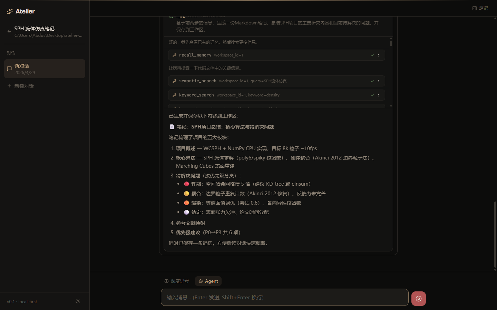
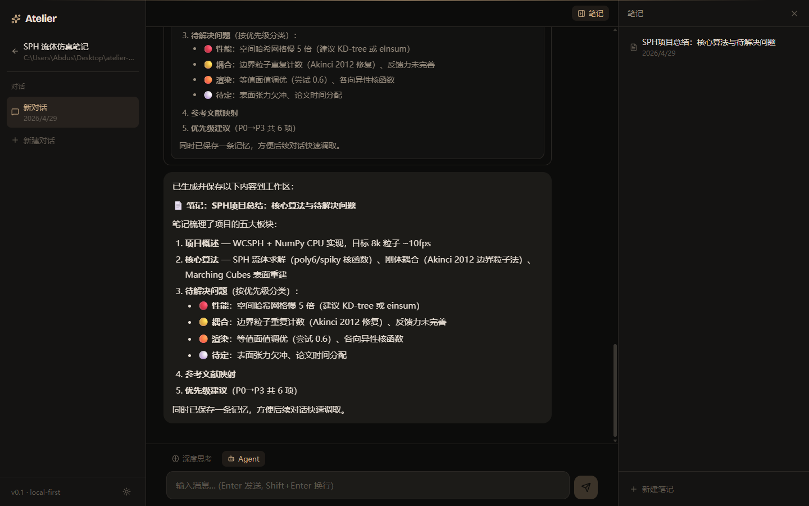
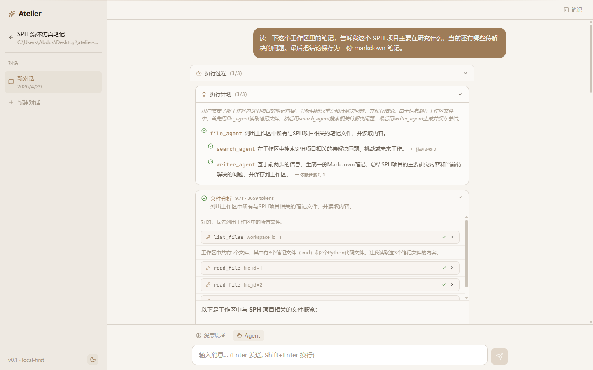

# Atelier

> A local-first AI copilot. You bring a workspace, it brings four specialist agents — they read, search, code-explain and write notes back to disk, all coordinated by an orchestrator that plans the run as a DAG.

Your data never leaves the machine. The only outbound call is the LLM API of your choice (defaults to DeepSeek; any OpenAI-compatible endpoint works).



---

## What it does

You point it at a folder. It scans the folder, chunks every text/code file, embeds the chunks into a local Chroma index, and opens a chat. From there:

- **Ask anything** about the workspace and get an answer with grounded citations.
- **Switch on Agent mode** — the orchestrator builds a multi-step plan, dispatches it across four specialist agents (file / search / code / writer), runs independent steps in parallel, and streams every tool call back to the UI as it happens.
- **The result is a markdown note** saved into the workspace. The next time you open the workspace, the agents recall what they wrote.

Everything is streamed over SSE, so a slow 30-second agent run feels alive — you watch the LLM think, you watch each tool call land, you watch the writer compose. If you close the tab mid-run the generation keeps going on the server and the next reconnect replays it.

## Tour

| | |
|---|---|
|  |  |
| Empty state. Add a workspace by name + path. | Agent mode. The orchestrator plans 3 steps with `depends_on` edges; the file agent already started reading. |
|  |  |
| Search agent — semantic + keyword in parallel, structured output with priority colours. | Writer agent — recalls memory, generates a 5-section markdown report, calls `save_note` and `save_memory`. |
|  |  |
| Notes panel — every saved markdown is one click away. | Light theme — same workspace, warm sand palette. |

## Architecture

```
┌──────────────── Frontend (React 19 + Vite + Tailwind v4) ────────────────┐
│  Sidebar · ChatView · NotesPanel · ToolCallBlock · ThinkingBlock          │
└────────────────────────────────┬──────────────────────────────────────────┘
                                 │  SSE (newline-delimited JSON)
┌────────────────────────────────▼──────────────────────────────────────────┐
│                    FastAPI · GenerationManager (background threads)       │
│  ┌────────────┐  ┌────────────┐  ┌────────────┐  ┌────────────┐           │
│  │   chat     │  │ workspace  │  │   files    │  │   notes    │  routes  │
│  └────────────┘  └────────────┘  └────────────┘  └────────────┘           │
│                                                                            │
│                          ┌─────────────────┐                               │
│                          │   Orchestrator   │   plans → DAG batches        │
│                          └────────┬─────────┘                              │
│                                   │ ThreadPoolExecutor                     │
│   ┌──────────────┬────────────────┼────────────────┬──────────────┐       │
│   ▼              ▼                ▼                ▼              ▼       │
│ FileAgent   SearchAgent       CodeAgent       WriterAgent     (ReAct loop) │
│   │              │                │                │                       │
│   └──────────────┴────────────────┴────────────────┘                       │
│                  │                                                         │
│              ToolRegistry — list_files / read_file /                       │
│              semantic_search / keyword_search /                            │
│              recall_memory / save_memory / save_note …                     │
└────────────────────────────────┬──────────────────────────────────────────┘
                                 │
        ┌────────────────────────┼─────────────────────────┐
        ▼                        ▼                         ▼
   SQLite (workspaces,      ChromaDB (chunks,          DeepSeek API
   files, chats, messages,   embeddings,               (OpenAI-compatible,
   notes, memories)          per-workspace             swap with any
                             collections)              model you like)
```

A few non-obvious choices:

- **Each agent owns its own `ToolRegistry`** instead of a global one — it's how each specialist gets a different toolset (the writer can save notes; the searcher can't).
- **The orchestrator resolves `depends_on` into batches** and runs each batch in a `ThreadPoolExecutor`. Independent steps run truly in parallel and emit interleaved events through a thread-safe queue, so the frontend sees both running side-by-side.
- **Generation runs in a daemon thread.** Closing the browser doesn't cancel the agent. `GET /api/messages/{id}/stream` replays the buffer when you reconnect.
- **Memory is per-workspace and auto-extracted.** After the writer agent finishes, an extractor scans the conversation for facts worth keeping (`save_memory`); future runs in the same workspace get them injected at the top of every prompt.

## Stack

- **Backend** — Python 3.11+, FastAPI, SQLAlchemy 2, SQLite, ChromaDB (local persisted), OpenAI Python SDK (pointed at DeepSeek)
- **Frontend** — React 19, Vite 8, Tailwind v4, react-markdown, lucide-react
- **Fonts** — Bricolage Grotesque (display), JetBrains Mono (code), Noto Sans SC (CJK)
- **LLM** — DeepSeek `deepseek-chat` for tool calls, `deepseek-reasoner` for thinking mode. Any OpenAI-compatible endpoint works — change `LLM_BASE_URL` and `LLM_MODEL`.

## Run it

You need Python 3.11+, Node 20+, and an LLM API key.

```bash
# 1. Backend
cd backend
python -m venv .venv
source .venv/Scripts/activate          # Windows: .venv\Scripts\activate
pip install -e ".[dev]"
cp .env.example .env                   # then put your LLM_API_KEY in .env
uvicorn app.main:app --reload          # → http://127.0.0.1:8000

# 2. Frontend
cd ../frontend
npm install
npm run dev                            # → http://127.0.0.1:5173
```

Open the frontend, click *新建工作区*, point it at any folder of markdown / code, and ask it something. First scan downloads a ~80 MB sentence-transformer (one-time) so Chroma can embed locally; everything after that is fast and offline-after-LLM.

### Configuration

Everything lives in `backend/.env`:

| Var | Default | Notes |
|---|---|---|
| `LLM_API_KEY` | *(required)* | Your DeepSeek (or compatible) key |
| `LLM_BASE_URL` | `https://api.deepseek.com` | Swap for OpenAI / Together / local Ollama, etc. |
| `LLM_MODEL` | `deepseek-chat` | Tool-calling model |
| `LLM_REASONING_MODEL` | `deepseek-reasoner` | Used when *深度思考* is on |
| `CHUNK_SIZE` | `500` | Characters per chunk before embedding |
| `MAX_HISTORY_MESSAGES` | `20` | How many past messages get sent each turn |
| `COMPACT_TRIGGER` | `10` | Auto-compact long threads beyond this many uncompacted messages |

Database (`atelier.db`) and Chroma index (`chroma_data/`) regenerate automatically on first run.

## Tests

```bash
cd backend && source .venv/Scripts/activate
pytest                                  # 16 tests across services / agents / tools
```

## Project layout

```
atelier/
├── backend/
│   ├── app/
│   │   ├── agents/         file · search · code · writer · orchestrator
│   │   ├── api/routes/     workspace · file · chat · note · system · health · browse
│   │   ├── services/       chunker · indexer · vector_store · memory · scanner
│   │   ├── tools/          file_tools · search_tools · code_tools · writer_tools · memory_tools
│   │   ├── llm/            DeepSeek client + streaming GenerationManager
│   │   ├── models/         SQLAlchemy ORM
│   │   └── schemas/        Pydantic request / response
│   └── tests/              pytest
└── frontend/
    └── src/
        ├── components/     Sidebar · ChatView · NotesPanel · ToolCallBlock · …
        └── api/            REST client per resource
```

## Status

v0.1 — feature-complete for the local single-user case. Ships with:

- ✅ Workspace + file scan + chunking + Chroma indexing
- ✅ Streaming chat with reconnect-replay and *deep thinking* toggle
- ✅ Multi-agent orchestrator with parallel DAG execution
- ✅ Per-workspace memory (auto-extracted + recalled)
- ✅ Tracing (per-step duration + token count) surfaced in the UI
- ✅ Markdown notes saved back to the workspace
- ⏳ Docker compose · packaging for distribution · multi-user auth — out of scope

## License

MIT.
